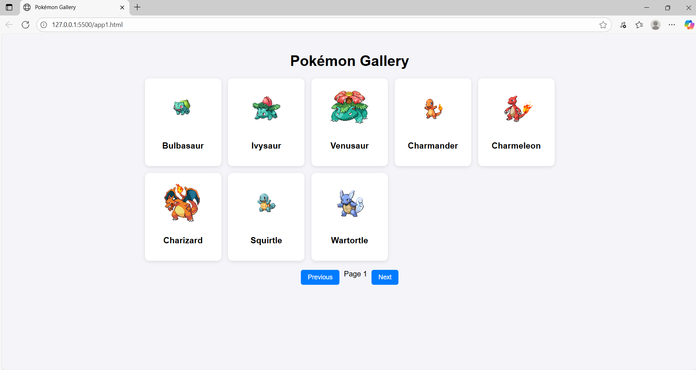

# Pokémon Gallery 🎮

A simple web application that fetches and displays Pokémon data from the [PokéAPI](https://pokeapi.co).  
Built with **HTML, CSS, and JavaScript**, and hosted on **GitHub Pages**.  

---

## 🚀 Features
- Fetches Pokémon data from a free public API.
- Displays Pokémon in a clean **grid layout** with images and names.
- **Pagination** support (Next & Previous buttons).
- **Loading state** while data is being fetched.
- **Error handling** for failed API requests.
- Responsive design for desktop and mobile.

---

## 🌍 Live Demo
🔗 [Pokémon Gallery](https://sud-git.github.io/pokemon-gallery/)  

---

## 📂 Project Structure
pokemon-gallery/

│── index.html # Main HTML file

│── screenshot.png # Screenshot preview

│── README.md # Project documentation

---

## 📸 Screenshot

---

## ⚙️ How It Works
1. The app fetches Pokémon data from the PokéAPI:
https://pokeapi.co/api/v2/pokemon?limit=8&offset=0

2. For each Pokémon, it retrieves additional details (like image + name).

3. Data is displayed inside a responsive **grid of cards**.

4. Pagination lets you browse Pokémon page by page.

🛠️ Technologies Used

HTML5

CSS3

JavaScript (Vanilla)

PokéAPI

GitHub Pages

## 👨‍💻 Author
**Sudhanshu Mishra**  
🔗 [GitHub Profile](https://github.com/sud-git)  